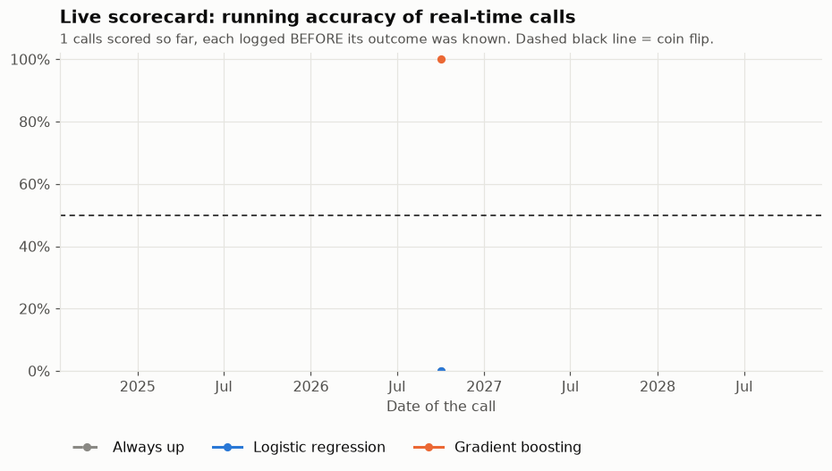

# TSM 5-day call: live scorecard

**Latest call** (close of 2026-10-06, TSM $482.30, result due about 2026-10-13):

- Logistic regression: **UP** (58% chance of UP)
- Gradient boosting: **UP** (58% chance of UP)

## Accuracy so far

| Strategy | Hits / scored | Accuracy | 95% range |
|---|---|---|---|
| Always up | 0 / 0 | n/a | n/a |
| Logistic regression | 0 / 0 | n/a | n/a |
| Gradient boosting | 0 / 0 | n/a | n/a |

The 95% range shows how much of the accuracy could be luck. Daily calls overlap (each covers 5 trading days), so the range treats N calls as about N/5 separate weeks.

## Last 10 calls

| Close of | Logistic | Boosting | Actual 5-day move |
|---|---|---|---|
| 2026-10-06 | UP (58%) | UP (58%) | pending |
| 2026-10-05 | UP (55%) | UP (58%) | pending |
| 2026-10-02 | UP (55%) | DOWN (50%) | pending |

